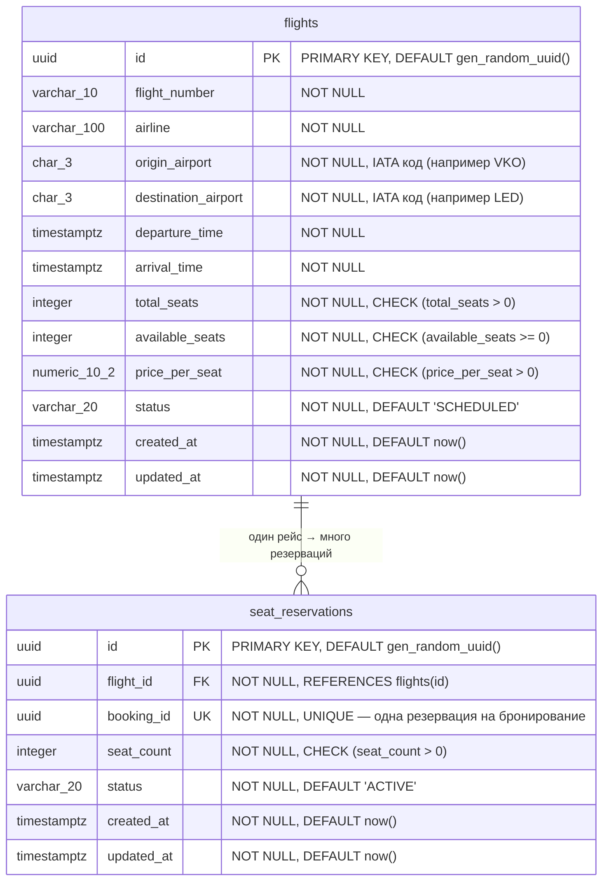
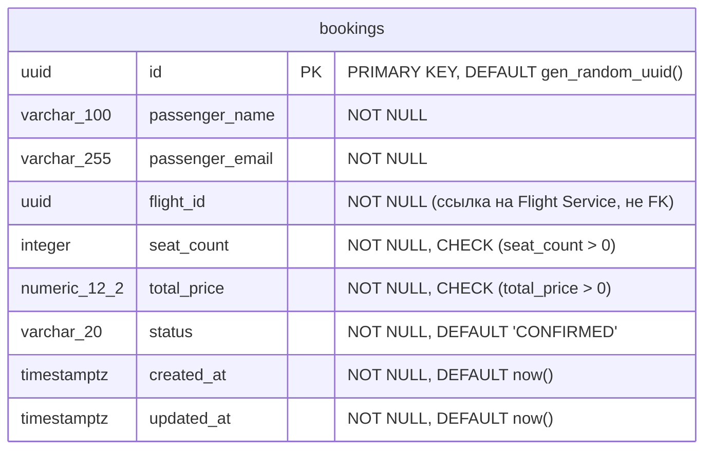
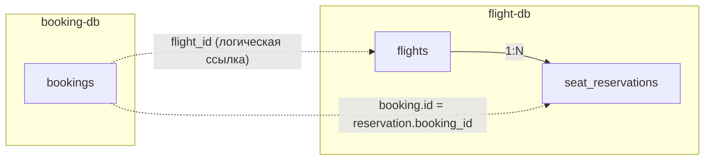

# er-diagram.md

# ER-диаграмма системы бронирования авиабилетов

Схема данных в третьей нормальной форме (3NF) для двух микросервисов
с раздельными базами данных PostgreSQL.

## Общая архитектура

```
Client (REST) → Booking Service → (gRPC) → Flight Service
                      ↓                          ↓
                 booking-db                 flight-db + Redis
```

---

## Flight Service Database (flight-db)



### Ограничения целостности (flights)

| Ограничение | SQL |
|---|---|
| Положительное число мест | `CHECK (total_seats > 0)` |
| Неотрицательные свободные места | `CHECK (available_seats >= 0)` |
| Свободных не больше общего | `CHECK (available_seats <= total_seats)` |
| Положительная цена | `CHECK (price_per_seat > 0)` |
| Вылет раньше прилёта | `CHECK (departure_time < arrival_time)` |
| Допустимые статусы | `CHECK (status IN ('SCHEDULED','DEPARTED','CANCELLED','COMPLETED'))` |
| Уникальный номер рейса на дату | `UNIQUE (flight_number, (departure_time::date))` |

### Ограничения целостности (seat_reservations)

| Ограничение | SQL |
|---|---|
| Положительное число мест | `CHECK (seat_count > 0)` |
| Допустимые статусы | `CHECK (status IN ('ACTIVE','RELEASED','EXPIRED'))` |
| Одна резервация на бронирование | `UNIQUE (booking_id)` |
| Привязка к рейсу | `FOREIGN KEY (flight_id) REFERENCES flights(id)` |

### Индексы (flights)

| Индекс | Назначение |
|---|---|
| `idx_flights_search (origin_airport, destination_airport, departure_time)` | Поиск рейсов по маршруту и дате |

### Индексы (seat_reservations)

| Индекс | Назначение |
|---|---|
| `idx_reservations_flight (flight_id)` | Поиск резерваций по рейсу |
| `idx_reservations_booking (booking_id)` | Поиск резервации по бронированию (UNIQUE) |

---

## Booking Service Database (booking-db)



### Ограничения целостности (bookings)

| Ограничение | SQL |
|---|---|
| Положительное число мест | `CHECK (seat_count > 0)` |
| Положительная стоимость | `CHECK (total_price > 0)` |
| Допустимые статусы | `CHECK (status IN ('CONFIRMED','CANCELLED'))` |

### Индексы (bookings)

| Индекс | Назначение |
|---|---|
| `idx_bookings_flight (flight_id)` | Поиск бронирований по рейсу |
| `idx_bookings_status (status)` | Фильтрация по статусу |
| `idx_bookings_email (passenger_email)` | Поиск бронирований по пассажиру |

> **Примечание:** `flight_id` в таблице `bookings` — это логическая ссылка
> на рейс из Flight Service, а не настоящий FOREIGN KEY, поскольку
> таблицы находятся в разных базах данных (микросервисная архитектура).

---

## Связи между сервисами



**Связи:**
- `bookings.flight_id` → `flights.id` — логическая ссылка между базами через gRPC
- `bookings.id` → `seat_reservations.booking_id` — одна резервация на каждое бронирование
- `seat_reservations.flight_id` → `flights.id` — FOREIGN KEY внутри одной БД

---

## Обоснование третьей нормальной формы (3NF)

### Первая нормальная форма (1NF)
✅ Все атрибуты атомарны — нет массивов, вложенных структур или составных полей.
Каждая ячейка содержит ровно одно значение.

### Вторая нормальная форма (2NF)
✅ Все первичные ключи — одноколоночные UUID. Частичных функциональных
зависимостей от части составного ключа быть не может, так как составных
ключей в схеме нет. Каждый неключевой атрибут полностью функционально
зависит от первичного ключа.

### Третья нормальная форма (3NF)
✅ Нет транзитивных зависимостей — каждый неключевой атрибут зависит
напрямую и только от первичного ключа своей таблицы:

- **flights**: все атрибуты (`flight_number`, `airline`, `origin_airport`,
  `destination_airport`, `departure_time`, `arrival_time`, `total_seats`,
  `available_seats`, `price_per_seat`, `status`) описывают конкретный рейс
  и не зависят друг от друга транзитивно.

- **seat_reservations**: все атрибуты (`flight_id`, `booking_id`,
  `seat_count`, `status`) описывают конкретную резервацию.
  `flight_id` — внешний ключ, а не транзитивная зависимость.

- **bookings**: все атрибуты (`passenger_name`, `passenger_email`,
  `flight_id`, `seat_count`, `total_price`, `status`) описывают
  конкретное бронирование. `total_price` — зафиксированная на момент
  бронирования стоимость (`seat_count × flight.price_per_seat`),
  а не вычисляемое поле. Цена рейса может измениться после бронирования,
  поэтому хранение `total_price` необходимо и не нарушает 3NF.

---

## Словарь статусов

### Flight.status

| Значение | Описание |
|---|---|
| `SCHEDULED` | Рейс запланирован, доступен для бронирования |
| `DEPARTED` | Рейс вылетел |
| `CANCELLED` | Рейс отменён |
| `COMPLETED` | Рейс завершён (приземлился) |

### SeatReservation.status

| Значение | Описание |
|---|---|
| `ACTIVE` | Резервация активна, места заняты |
| `RELEASED` | Резервация отменена, места возвращены |
| `EXPIRED` | Резервация истекла по таймауту |

### Booking.status

| Значение | Описание |
|---|---|
| `CONFIRMED` | Бронирование подтверждено |
| `CANCELLED` | Бронирование отменено пользователем |